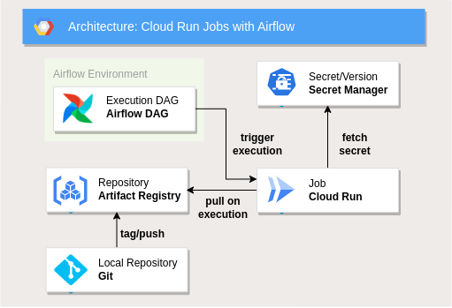

# Airflow & CloudRun Jobs

Repository with sample code + instructions to schedule containerized applications with Airflow and Google Cloud Run 




### Project Set-UP:

```
cloudrun_airflow
│   README.md 
│
└───application
│   │   main.py: psample code of minimalistic python Application 
│   │   Dockerfile: Multistage Dockerfile to build image from the application
│   │   poetry.lock/pyproject.toml: Poetry set-up  
│   │   readme.md: further instructions  
│   
└───dags
    │   simpleapp_dag_v1.py: Airflow DAG to deploy and monitor Cloud Run Job
    │   .env: Airflow Variables to be set
```